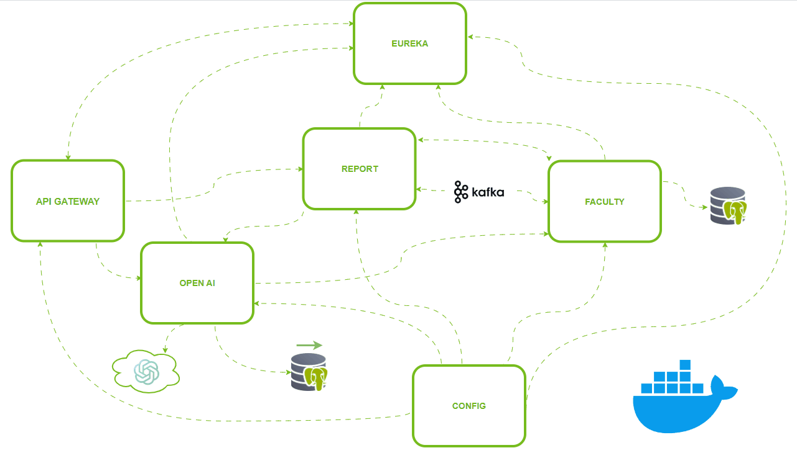

# Demo Microservices

## Table of Contents

1. [Introduction](#introduction)
2. [Architecture](#architecture)
3. [Microservices](#microservices)
    - [API Gateway](#api-gateway)
    - [Eureka Server](#eureka-server)
    - [Config Server](#config-server)
    - [Faculty Microservice](#faculty-microservice)
    - [Report Microservice](#report-microservice)
    - [OpenAI Microservice](#openai-microservice)
4. [Prerequisites](#prerequisites)
5. [Running the application](#running-the-application)
7. [Application links](#application-links)

## Introduction

This demo application showcases the implementation of Spring Boot microservices, highlighting their powerful features
and capabilities, with a particular emphasis on integrating OpenAI for advanced AI functionalities.

## Architecture



- **Java 21**: The latest long-term support (LTS) version of Java, providing modern language features and performance
  improvements.
- **Spring Framework 6**: A comprehensive framework for enterprise applications, providing support for dependency
  injection, aspect-oriented programming, and more.
- **Spring Boot 3**: A convention-over-configuration solution to create stand-alone, production-grade Spring-based
  applications with ease.
- **PostgreSQL**: An advanced open-source relational database with robust features and performance.
- **pgvector**: An extension for PostgreSQL that provides vector similarity search, enhancing capabilities for
  machine learning applications.
- **Liquibase**: A database schema change management solution that allows for tracking, versioning, and deploying
  database changes.
- **Apache Kafka**: A distributed streaming platform used for building real-time data pipelines and streaming
  applications.
- **OpenAPI (formerly known as Swagger)**: A specification for defining and documenting RESTful APIs. The OpenAPI
  Specification (OAS) enables interactive
  documentation, code generation, and API client creation.
- **Jasper Reports**: An open-source reporting tool for creating, displaying, and exporting reports in various formats.
- **OpenAI**: Integrates with OpenAI's GPT models to provide advanced natural language processing capabilities.
- **RAG (Retrieval-Augmented Generation) with OpenAI**: Combines retrieval of relevant documents and generation of
  responses using OpenAI's models to enhance the accuracy and relevance of generated content.
- **Docker**: A platform that enables the creation, deployment, and management of containerized applications, ensuring
  consistency across multiple environments and simplifying deployment processes.

## Microservices

### API Gateway

The API Gateway acts as the single entry point for all client requests. It routes incoming requests to the appropriate
service, ensuring secure and efficient communication between clients and backend services.

### Eureka Server

The Eureka Server is used for service discovery. It maintains a registry of all the microservices, allowing them to
discover each other and enabling dynamic scaling and fault tolerance within the system.

### Config Server

The Config Server provides centralized configuration management. It allows all microservices to retrieve their
configurations from a central place, ensuring consistency and simplifying the management of configuration changes.

### Faculty Microservice

The Faculty Microservice uses Liquibase scripts to create tables in database, insert test data and it is responsible for
handling all operations related to faculty members. This includes CRUD operations, data processing, and interactions
with other services as needed. It also operates as a
Kafka consumer, continuously listening for and processing messages from specified Kafka topic to handle real-time data
streams efficiently.

### Report Microservice

The Report Microservice calls the OpenAI microservice synchronously via Feign (Declarative REST Client) to generate a
summary
for a course. It then creates a PDF report using Jasper Reports. Additionally, it acts as a Kafka producer, sending the
course summary to a specified Kafka topic.

### OpenAI Microservice

The OpenAI Microservice integrates with OpenAI's API to provide advanced AI functionalities. OpenAI is an artificial
intelligence research organization that provides powerful models like GPT (Generative Pre-trained Transformer) for
various AI applications including natural language processing, text generation, and more.

Key features of the OpenAI Microservice include:

1. **Summary Generation**: Uses the Spring AI chat client to obtain summaries from OpenAI based on provided content.

2. **Data Synchronization**: Syncs student data from a relational database to a vector database using Spring AI Vector
   Store. This facilitates efficient storage and retrieval of high-dimensional data.

3. **RAG (Retrieval-Augmented Generation)**: Performs similarity searches for a given question over the local vector
   database to find relevant data. The relevant data, which is based on our own datasets that OpenAI is not trained on,
   is then sent to OpenAI to generate a contextually appropriate response. This feature enhances the accuracy and
   relevance of generated responses by leveraging local, proprietary data.

These functionalities enable the OpenAI Microservice to support a wide range of AI-driven applications, enhancing the
overall capabilities of the system.

## Prerequisites

- Java 21 or higher
- Maven
- Docker

## Running the Application

1. Clone the repository:
   ```sh
   git clone https://github.com/vukmanovicmilos/web-app.git
2. Run maven:
   ```sh
   mvn install
3. To run the application, navigate to the root directory of the project and execute the following command:
    ```sh
    docker compose up

### *Don't forget to set your API key in the docker-compose.yml file:

    SPRING_AI_OPENAI_API_KEY = <YOUR_API_KEY>

## Application links

### Some important links

- Eureka: [http://localhost:8761/](http://localhost:8761/)
- Config Server (yml for faculty): [http://localhost:8888/faculty/default](http://localhost:8888/faculty/default)
- Faculty Open API (Swagger)
  documentation: [http://localhost:9100/swagger-ui/index.html](http://localhost:9100/swagger-ui/index.html)
- Generate PDF report via API Gateway: [http://localhost:8765/report/reports/3](http://localhost:8765/report/reports/3)
- Sync students from relational to vector database via API
  Gateway: [http://localhost:8765/open-ai/open-ai/sync-students](http://localhost:8765/open-ai/open-ai/sync-students)
- Get response from OpenAI for question (default) via API
  Gateway: [http://localhost:8765/open-ai/open-ai/question](http://localhost:8765/open-ai/open-ai/question)


